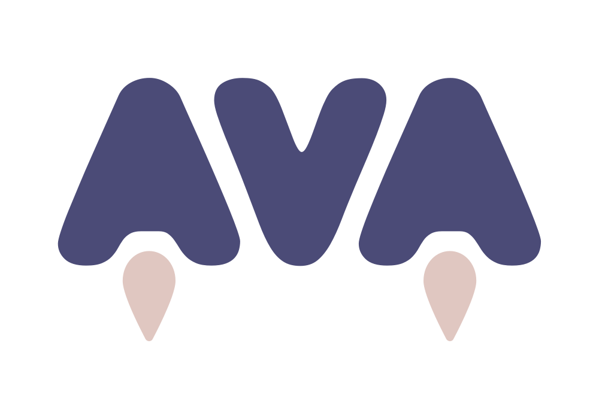

<center>
  
</center>

## Odcinki

1. Sprawdzenie możliwości - [notatka](./episodes/ep-1.md) - [YT](https://www.youtube.com/watch?v=xSON_R3tMfE)
2. Pierwsze testy - [notatka](./episodes/ep-2.md) - [YT](https://www.youtube.com/watch?v=pxCgWIEsXJU)
3. Testy asynchroniczne - [notatka](./episodes/ep-3.md) - [YT](https://www.youtube.com/watch?v=EEs6Y60LgaU)
4. Przegląd API - [notatka](./episodes/ep-4.md) - [YT](https://www.youtube.com/watch?v=2Ylez69fu68)
5. Execution Context & Assertions - [notatka](./episodes/ep-5.md) - [YT](https://www.youtube.com/watch?v=Sdb3UpQCz5wg)

## Jak się wymawia nazwę tej biblioteki?

Zgodnie z https://github.com/avajs/ava/#how-is-the-name-written-and-pronounced

- poprawna nazwa: `AVA`, nie `Ava` ani `ava`
- poprawna wymowa: `/ˈeɪvə/`

## Jak włączyć użycie ES Modules w AVA v3.x?

W pliku `package.json` dodać:

```json
  "ava": {
    "require": [
      "esm"
    ]
  }
```

W wersji 4.0.0 dodano wsparcie do ES Modules:
https://github.com/avajs/ava/releases/tag/v4.0.0

## Przegląd API

- `test.only` — Uruchomienie tylko tego testu
- `test.skip` — Wyłączenie testu
- `test.todo` — Stworzenie testu (bez implementacji)
- `test.failing` — Oczekiwania testu, który sfailuje
- `test.after` — Zdefiniowanie operacji, która uruchomi się RAZ przed wszystkimi testami
- `test.afterEach` — Zdefiniowanie operacji, która uruchomi się KILKA RAZY przed każdym testem
- `test.before` — Zdefiniowanie operacji, która uruchomi się RAZ po wszystkich testami
- `test.beforeEach` — Zdefiniowanie operacji, która uruchomi się KILKA RAZY po każdym teście
- `test.macro` — Zdefiniowanie makra, ale po co ono jest? Nie wiem
- `test.meta` — Obiekt z informacjami: aktualna ścieżka do pliku, funkcja zwracająca ścieżkę do katalogu ze snapshotami
- `test.serial` — Obiekt, który zapewnia to samo API to zwykły `test`, ale testy nim oznaczona uruchamiają się sekwencyjnie, zamiast jednocześnie (domyślne zachowanie)
